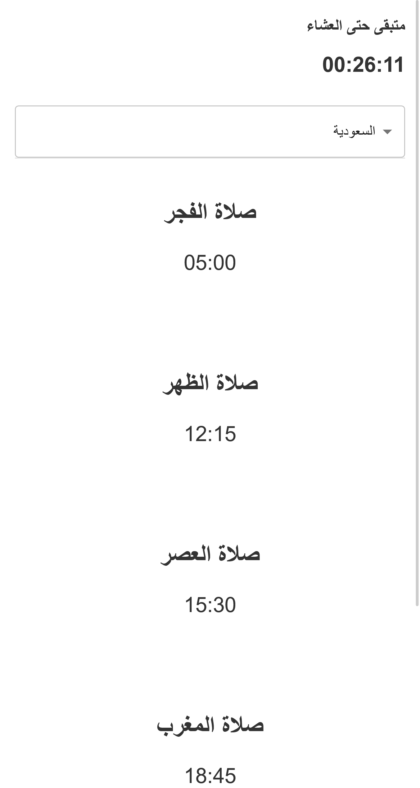

# Prayer Times Project

This project displays prayer times for a specific country using React. It provides a simple user interface for users to select from various countries and view the prayer times.





## Features

- Simple and user-friendly interface.
- Ability to select a country to display prayer times.
- Responsive design that adapts to different screen sizes.
- Option to display the time below the prayer name.

## Technologies Used

- React
- Material-UI (or any other UI library you might be using)
- CSS (or any other CSS framework like Tailwind CSS)
- JavaScript

## Getting Started

1. Ensure you have Node.js and npm installed on your machine.
2. Clone the repository:

   ```bash
   git clone <repository_link>
